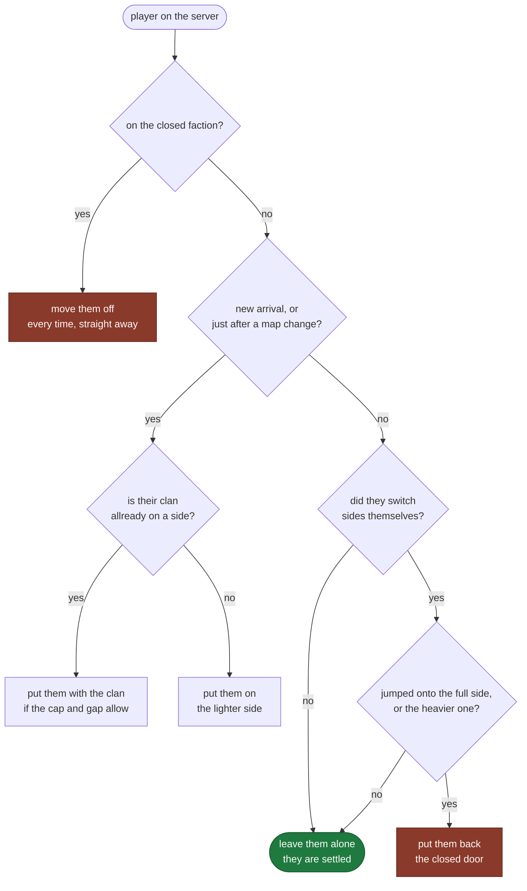

# WARDOGS RVG 50v50 Balancer

[](https://github.com/AE-WD-BATTLESUITE/WARDOGS-RVG-50v50/actions/workflows/test.yml)
[](LICENSE)
[](https://nodejs.org)
[](package.json)
[](selftest.js)


Keeps the teams even on a WARDOGS server with out draging people out of a fight.

If youve run a 50v50 box you allready know the problem. One side stacks, the other side
gets rolled, and twenty minutes later youve got a dozen people left and the match is
dead. Most autobalancers "fix" that by grabbing somebody who is holding a roof and
teleporting them to the other team. That works once. Then they leave, and so does
everyone else who watched it happen.

This one dosent do that. It evens the teams by putting NEW people on the lighter side
and leaves everyone who is allready playing alone. It shuts the third faction so you get
a proper red v green fight, and it keeps clan tags together so you turn up with your
mates and stay with your mates.

The rules in here came off live 50v50 servers, not off a whiteboard. Every one of them
exists becuase somthing went wrong first. This is that logic pulled out into somthing you
can run on your own box.

Being straight with you about what that means: **the rules are proven, this exact package
is not yet.** It has 36 tests, and a stress harness that throws 660 randomised matches at it
looking for any case where it breaks its own promises, and finds none. Both of those ship
with it, so you dont have to take my word for either: `npm test` and `npm run stress`.

It has also sat on a live 50v50 in dry run, reading a real server every two seconds for
twelve minutes while it was draining out. People quit off one side until it was 7 against
13, a gap of six on a tolerance of three, and it moved nobody, becuase every one of them
was settled in a round that had allready started. That is the promise, and that is what it
looks like when its working properly. It waits for the map change.

What it has **not** done is move a real player on a real server. The reading is proven, the
deciding is proven, the one write call has never fired in anger. So run it with `--dry-run`
for a match before you trust it, and you will see every call it would make without it
touching anybody.

**It needs a server that people are actualy joining.** It balances by placing new
arrivals, not by draging people who are allready playing. On a busy box thats invisible
and the teams just stay even. On a dead box it cant do much, and theres a section on that
below so your not suprised by it.

No database, no discord bot, no npm packages to install. Node 18 and thats it. It only
ever talks to the host and port you put in your own config, nothing else.

---

## Contents

- [What it does, in one picture](#what-it-does-in-one-picture)
- [What you need](#what-you-need)
- [Setting it up](#setting-it-up)
  - [Step 1. Turn RCON on in your server](#step-1-turn-rcon-on-in-your-server)
  - [Step 2. Install Node](#step-2-install-node)
  - [Step 3. Get the files](#step-3-get-the-files)
  - [Step 4. Make your config](#step-4-make-your-config)
  - [Step 5. Check you havent fat fingered it](#step-5-check-you-havent-fat-fingered-it)
  - [Step 6. Prove it to yourself](#step-6-prove-it-to-yourself)
  - [Step 7. Watch it think, without letting it touch anybody](#step-7-watch-it-think-without-letting-it-touch-anybody)
  - [Step 8. Let it run for real](#step-8-let-it-run-for-real)
- [Keeping it up](#keeping-it-up)
- [The rules](#the-rules)
- [Settings](#settings)
  - [Admins](#admins)
  - [Rescue, for when a match is already ruined](#rescue-for-when-a-match-is-already-ruined)
  - [Announcements](#announcements)
- [What it writes](#what-it-writes)
- [Running it alongside other tools](#running-it-alongside-other-tools)
- [When it goes wrong](#when-it-goes-wrong)
- [Changing it](#changing-it)
- [Common objections](#common-objections)
- [A note on the code](#a-note-on-the-code)

---

## What it does, in one picture

Every couple of seconds it looks at your server and runs each player through this. Thats
the whole algorithm.



The green box is where most players live. **Nobody who is simply playing ever gets moved.**

---

## What you need

- A WARDOGS dedicated server with RCON turned on, and the RCON password.
- Node.js 18 or newer, on anything that can reach the RCON port.

Thats the list. It dosent have to run on the game box. A cheap VPS, a spare pi, your
desktop, all fine.

---

## Setting it up

Start to finish, assuming you've never touched Node before. Takes about ten minutes.

### Step 1. Turn RCON on in your server

This is the bit most people get stuck on, so do it first. The balancer talks to your
server through RCON, and if thats not switched on then nothing else matters.

Find your servers config file. On most hosts thats in a web panel under Configuration
Files, or if you run the box yourself its the ini file next to the server. Youre looking
for a block like this, and if it isnt there you add it:

```ini
[/Script/WDRCON.WDRCONSettings]
bEnabled=true
Password=pick-somthing-long-and-random
Port=7779
```

Three things to get right:

- **`bEnabled=true`.** If this says false, nothing works and you get "no player list".
- **`Password`.** Make one up. Long and random. This is not your game password, its not
  your admin password, its its own thing. Anybody who has it can control your server, so
  treat it like one.
- **`Port`.** This is **NOT your game port**. If your game runs on 7777, RCON is a
  seperate port, often 7776 or 7779. Whatever number is in this block is the one you want.
  Some hosts pin it on the command line with `-RCONPort`, and if they do, that wins and
  the number in the file gets ignored.

Restart the server after changing it, or it wont pick the settings up.

If your host has a firewall, make sure that RCON port is reachable from wherever youre
going to run the balancer. If your running it on the same box, your fine.

### Step 2. Install Node

The balancer is a Node program. You need version 18 or newer. Theres nothing else to
install, no database, no packages.

**Windows:** go to [nodejs.org](https://nodejs.org), download the LTS installer, run it,
click next until its done.

**Linux (Ubuntu/Debian):**

```bash
curl -fsSL https://deb.nodesource.com/setup_20.x | sudo -E bash -
```

```bash
sudo apt install -y nodejs
```

Check it worked. This should print something starting with `v18` or higher:

```bash
node --version
```

If it says "command not found", Node didnt install or you need to open a fresh terminal.

### Step 3. Get the files

**If you have git:**

```bash
git clone https://github.com/AE-WD-BATTLESUITE/WARDOGS-RVG-50v50.git
```

**If you dont**, click the green Code button at the top of this page, then Download ZIP,
and unzip it wherever you like.

Either way, go into the folder:

```bash
cd WARDOGS-RVG-50v50
```

### Step 4. Make your config

Copy the example so youve got somthing to edit:

**Windows:**

```bash
copy config.example.json config.json
```

**Linux/Mac:**

```bash
cp config.example.json config.json
```

Now open `config.json` in any text editor (Notepad is fine) and find the `servers` bit at
the bottom. You only have to change four things per server:

```json
"servers": [
  {
    "name": "my server",
    "host": "YOUR.IP",
    "port": 7779,
    "token": "the-password-from-step-1"
  }
]
```

- **`name`** is just a label for you. Call it whatever. It shows up in the logs.
- **`host`** is your servers IP address. Same one people connect to.
- **`port`** is the RCON port from step 1. **Not the game port.**
- **`token`** is the RCON password from step 1.

Got more than one server? Copy the whole `{ ... }` block, comma between them:

```json
"servers": [
  { "name": "server 1", "host": "YOUR.IP", "port": 7779, "token": "PUT_THE_PASSWORD_HERE" },
  { "name": "server 2", "host": "OTHER.IP", "port": 7779, "token": "PUT_THE_PASSWORD_HERE" }
]
```

Everything else in the file has sensible defaults. Leave it alone until you know what you
want to change.

> **`config.json` now has your RCON password in it.** Dont email it, dont paste it in
> discord, and dont commit it anywhere. Its allready in `.gitignore` so git will leave it
> be unless you go out of your way. If youd rather it never sat in a file at all, see
> [SECURITY.md](SECURITY.md).

### Step 5. Check you havent fat fingered it

```bash
node index.js --check
```

This reads your config and either tells you its fine, or tells you exactly whats wrong in
plain english. It doesnt connect to anything, so its safe to run as many times as you like.

Common ones:

| What it says | What it means |
|---|---|
| `is not valid JSON` | You lost a comma or a quote. Paste the file into jsonlint.com and it'll point at the line. |
| `needs a "token"` | You left the password out, or left `PUT_YOUR_RCON_PASSWORD_HERE` in. |
| `needs a "port"` | Missing port, or you put it in quotes when it should be a plain number. |
| `still has the example password in it` | You copied the example and forgot to put your own password in. |
| `still has the example host in it` | Same, but the IP. `YOUR.IP` and the `203.0.113.x` range are placeholders, they go nowhere. |

### Step 6. Prove it to yourself

Before you point it at anything real, run the tests. This fakes a whole server in memory
and checks every rule. It never touches the network:

```bash
node selftest.js
```

You should get `36 passed, 0 failed`. If you dont, somthings wrong with your Node install,
not with your server.

If you want to push it harder, `npm run stress` makes up 660 random servers with people
joining, quitting and team hopping all over the place, and checks after every single tick
that none of the promises above got broken. Takes a couple of minutes. It prints the seed
for anything that fails, so a failure is reproducible rather than a ghost.

### Step 7. Watch it think, without letting it touch anybody

```bash
node index.js --dry-run
```

Now it connects to your actual server and reads it, but **moves nobody**. Everything it
would have done gets printed as `WOULD MOVE`. Leave it running through a full match.

What you should see within a few seconds:

```
[2026-01-01 20:00:00] running in DRY RUN, nobody gets moved, 1 server(s) every 2s: my server
[2026-01-01 20:00:00] [my server] seeded 64 player(s). this round is left alone, evening starts next match.
```

If instead you get `no player list. box down, wrong port, or the token is not the token`
then go back to step 1. Nine times out of ten its the port.

Stop it with Ctrl+C when youve seen enough.

### Step 8. Let it run for real

```bash
node index.js
```

Thats it. Its working.

**One thing so you dont think its broken:** for the rest of the current round it wont move
anybody. It writes everyone down as settled and leaves them alone. It starts evening the
teams at the next map change. Thats deliberate, its the whole point of the thing, and
theres a section further down explaining why.

---

## Keeping it up

**pm2**

```bash
npm install -g pm2
pm2 start ecosystem.config.js
pm2 save
```

**systemd**, at `/etc/systemd/system/wd-balancer.service`:

```ini
[Unit]
Description=WARDOGS team balancer
After=network-online.target

[Service]
Type=simple
User=wdbalancer
WorkingDirectory=/opt/wd-balancer
ExecStart=/usr/bin/node /opt/wd-balancer/index.js
Restart=always
RestartSec=10

[Install]
WantedBy=multi-user.target
```

Then `systemctl enable --now wd-balancer`.

**Only ever run one copy.** Two of these will fight over the same players and bounce them
between sides all night. If youve got more servers add them to the `servers` list, dont
start a second one.

---

## The rules

This is the important bit. Read it before you put it on a busy server.

**Settled players never get moved mid match.** Once its seen you and placed you, your left
alone till the next match. Balance happens by putting NEW arrivals on the lighter side,
not by teleporting somebody who is holding a position.

**The round its started on is never touched.** When it boots, or reboots, it writes down
everyone playing and marks them settled. What ever state the teams are in, its not its to
fix. Evening starts at the next match. This is deliberate and its why you can install it
at 9pm on a full server with out worrying.

**It remembers across a restart.** State goes to disk every couple of seconds. Crash it,
update it, reboot the box, it picks up where it was instead of desiding everyone is fresh
and rearanging a live game.

**New arrivals go to the lighter side.** Unless thier clan is allready somewhere, in wich
case they go to the clan, unless that would break the cap or blow the gap out.

**The closed side gets emptied constantly.** By default `Lonestar` is shut, so anyone who
picks it gets moved within a couple of seconds. Set `closedFaction` to `null` if you want
all three open.

**The closed door.** This is the anti stack rule. A settled player who switches sides
THEMSELFS mid match gets put back if the side they jumped to is full, or is allready
heavier than the tolerance. Jumping to the LIGHTER side is allways fine, because somebody
volenteering to even it up is doing your job for you. Players who just play are never
touched by this, and thats what keeps the no mid match moves promise honest.

**At a new match the teams get sorted.** It spots a new match three ways: the map rotated,
the scores reset, or the servers uptime droped, wich catches a restart the other two would
miss.

**Clan grouping is a prefrence, not a rule.** A clan tag is a braket at the front,
`[WOLF] someone`. It will try and put you with your tag but it wont break the cap or
wreck the balance to do it. Turn it off with `clanGrouping: false`.

**Cooldowns.** Nobody gets moved twice inside 30 seconds by default. Clearing the closed
side uses a shorter 5 seconds so it empties quick.

**If a side collapses mid match it will NOT drag people across.** This is the rule
working, not the tool being broken, but you should know what it looks like. Say green
gets rolled and 22 of them quit at once, leaving 45 v 23. The balancer moves nobody. It
fixes it two ways only: new arrivals all get sent to the light side, and the next map
change re evens everybody.

Measured, from a 45 v 23:

| whats happening | gap after 5 min | gap after 30 min |
|---|---|---|
| busy, people joining steadily | back to even inside 10 min | even |
| a trickle, one join every 40s | 13 | 2 |
| nobody joining at all | 22 | 22, till the map changes |

So on a full server you will never notice. On a dying server it sits there, because every
player left is settled and settled players dont get moved. **If it gets silly and nobody
is joining, restart the match.** That re evens everyone in one go and costs you less than
watching the server empty out. Thats the intended fix, its not a workaround.

If you dont want to be sat watching for that, `rescue` below does it for you.

**Clearing the closed side beats the cap.** If both playing sides are somehow at the cap
and somebody is still sat on the closed faction, they get moved anyway and that side goes
one over. Leaving a player stuck on a shut faction is worse than 51 a side. On a 100 slot
box with a cap of 50 this cant come up.

---

## Settings

Everything except `servers` has a default, so the smallest config that works is just a
server list.

| Key | Default | What it does |
|---|---|---|
| `pollSeconds` | `2` | How often it looks at each server. |
| `dryRun` | `false` | Decide and log everything, move nobody. |
| `sideCap` | `50` | Hard max per side. `32` for 32v32, and so on. |
| `gapTolerance` | `3` | How uneven its allowed to get before it acts. |
| `closedFaction` | `"Lonestar"` | Side to keep empty. `null` leaves all three open. |
| `clanGrouping` | `true` | Try and keep clan tags together. |
| `exempt` | `[]` | Steam ids the balancer never touches. Your admins. |
| `moveCooldownSeconds` | `30` | Minimum gap between moves for one player. |
| `bounceCooldownSeconds` | `5` | Shorter cooldown for clearing the closed side. |
| `joinMessage` | `""` | Private line sent once to each new arrival. Empty turns it off. |
| `announce.message` | the default line | What it broadcasts. Yours replaces it. `""` turns it off. |
| `announce.everyMinutes` | `60` | How often it goes out. Minimum 5. |
| `announce.minPlayers` | `10` | Dont bother announcing to a near empty server. |
| `keepMatchHistory` | `true` | Log the last 300 matches to disk. |
| `stateDir` | `"./state"` | Where state and history live. Relative to the config file. |

Per server you need `name`, `host`, `port` and either `token` (the RCON password) or
`tokenEnv` (the name of an environment variable holding it). You can also set
`enabled: false` to park one, and override `sideCap`, `gapTolerance`, `closedFaction`,
`clanGrouping`, `joinMessage` or the `announce` timing for just that server.

The `name` is only a label but its the key the state gets saved under. Rename a server and
it treats it as a brand new one and re seeds.

### Admins

Put your admins steam ids in `exempt` and the balancer leaves them completly alone:

```json
"exempt": ["00000000000000001", "00000000000000002"]
```

Without this, an admin who hops sides to go and watch somebody gets treated like a
stacker and put straight back, wich is useless when your trying to work. Has to be steam
ids, not names, becuase names change and ids dont.

Be aware an exempt person is exempt from **everything**, including getting pulled off the
closed faction. Thats on purpose so an admin can sit where they like, but it does mean
you shouldnt exempt somebody just because you like them.

**Slots are a seperate thing.** If you want an admin to be able to get onto a full
server, thats `MaxReservedSlots` and `DefaultReservedPlayerIds` in your servers own
config, not anything to do with this tool. A 100 slot box with 2 reserved slots fills to
98, wich the balancer will sit at about 49 v 49 anyway.

### Rescue, for when a match is already ruined

**Off by default.** Restarting somebody elses match uninvited is rude, so you have to
switch this on yourself.

When its on and the teams collapse badly, it warns everyone, gives them a chance to sort
it out themselves, and restarts the round if they dont. The restart re evens everybody
through the normal match-start logic, so nobody gets dragged out of a firefight, the
round just starts again fair.

```json
"rescue": { "enabled": true }
```

**When it decides the teams are broken.** Not on the gap on its own, becuase a gap of 10
means somthing very different at 100 players than at 30. It goes on how much of the
server is stuck on the small side:

| teams | small side | verdict |
|---|---|---|
| 59 v 48 | 44.9% | fine |
| 40 v 30 | 42.9% | fine |
| 50 v 35 | 41.2% | fine |
| 40 v 25 | 38.5% | broken |
| 45 v 23 | 33.8% | broken |

The line is **40%**. On top of that it needs at least 20 players on and a gap of at
least 8, so it leaves quiet servers alone and cant trip over 12 v 6.

**And it has to actualy be costing somebody the match.** If the score is still close its
not hurting anyone, so nothing happens no matter how lopsided it looks. The leader has to
be more than **15 points** clear.

**What players see.** Once its been broken for 3 minutes, one broadcast:

```
Teams are badly unbalanced. Switch to the smaller side now or this match will be restarted.
```

They then get 90 seconds. Switching to the smaller side is allways allowed, so anyone who
does as they are asked goes straight through. **If enough of them switch, the teams come
back inside the line and no restart happens.** If they dont, the round restarts.

After a restart theres a 15 minute cooldown so it cant sit there restarting on a loop.

| Key | Default | What it does |
|---|---|---|
| `rescue.enabled` | `false` | The whole thing. Off unless you turn it on. |
| `rescue.minorityShare` | `0.40` | Small side must be at least this much of the server. |
| `rescue.minPlayers` | `20` | Below this it leaves the server alone. |
| `rescue.minGap` | `8` | Absolute gap needed as well as the share. |
| `rescue.scoreLead` | `15` | Leader must be this far ahead before anything happens. |
| `rescue.graceMinutes` | `3` | How long its allowed to be broken before the warning. |
| `rescue.warnSeconds` | `90` | How long they get to fix it themselves. |
| `rescue.cooldownMinutes` | `15` | No second restart inside this. |
| `rescue.warning` | see above | The line they get told. |

Run it with `--dry-run` first. It logs `WOULD WARN` and `WOULD RESTART MATCH` without
touching anything, so you can watch it make the call for a few matches before you trust
it with your server.

### Announcements

It broadcasts one line to your server on a timer. Out of the box thats:

```
AERECRUIT.COM - the home of the 50v50
```

Thats the default, not a condition. The licence is MIT and you can do what you like. If
you leave it alone it sends that, wich is how I get anything back for putting the work in.
If you want your own line in there, put it in and yours goes out instead:

```json
"announce": {
  "everyMinutes": 60,
  "minPlayers": 10,
  "message": "MYCLAN.COM - come and squad up"
}
```

And if you dont want it saying anything at all, set the message to empty and it never
sends a thing:

```json
"announce": { "message": "" }
```

It wont fire the second you start the balancer so restarting dosent spam anybody. Minimum
is 5 minutes. Hourly is plenty, and pushing it harder just gets your own players muting
server chat, wich helps nobody.

---

## What it writes

In `stateDir`:

- `balancer-state.json`, the per server memory. Safe to delete while its stopped. If you
  do, it just re seeds and leaves the current round alone.
- `match-history.json`, the last 300 matches with how long they ran, peak players a side,
  the worst gap it reached and how many times the closed side had to be cleared. Handy
  when somebody insists the teams are allways stacked and youd like to actualy check.

---

## Running it alongside other tools

Everything it does is a normal RCON API call, the same ones any admin tool uses:

| Call | What for |
|---|---|
| `GET /v1/players` | who is on and what side thier on |
| `GET /v1/status` | map and scores, to spot a new match |
| `GET /v1/health` | uptime, to spot a restart |
| `PATCH /v1/players/{id}` | move one player to a faction |
| `POST /v1/players/{id}/message` | the private welcome line |
| `POST /v1/broadcast` | the timed line, and the rescue warning |
| `POST /v1/match/restart` | only if you turn `rescue` on |

Thats the complete list. It cant ban, kick, change maps or write your server config
because it never calls those. So it sits happily next to an admin bot or what ever else
youve got on RCON.

The one thing to avoid is running **another autobalancer at the same time**. Two things
with opinions about wich side you belong on will move you back and forth forever. Pick
one.

---

## When it goes wrong

**`no player list. box down, wrong port, or the token is not the token.`**
The RCON call failed. Check the host, check the port, check the password, and check the
machine running this can actualy reach that port. Nine times out of ten its the port.

**Its not moving anyone.** The first round after startup is left alone on purpose. Wait
for a map change. Also check you didnt leave `--dry-run` on.

**Its sat at 45 v 23 and doing nothing.** Working as intended. It will not pull settled
players out of a fight, so a mass quit only gets fixed by new arrivals or by the next map.
If nobody is joining, restart the match. Or turn on `rescue` and let it do that for you.

**It restarted a match and I didnt want it to.** Thats `rescue`, and its off unless
somebody switched it on. Turn it off, or raise `minorityShare` toward 0.45 so it only
fires on a proper collapse, or raise `scoreLead` so it waits for a bigger blowout.

**It moved somebody I didnt expect.** The log line tells you why: `balance`, `closed side`
or `bounced`.

**People keep getting put back.** Thats the closed door doing its job. Thier choosing to
jump to the full or heavy side. Raise `gapTolerance` if you want to be softer about it.

**Moving somebody respawns them.** Thats how the games faction change works, not something
this can soften. Its exactly why it tries so hard to never move anyone who is allready
settled.

---

## Changing it

If you just want to run it, you dont need to fork anything. Your settings live in
`config.json`, which is a seperate gitignored file, so `git pull` gets you updates without
touching your setup.

If you want to change the code itself, fork it. If you want to send somthing back, open a
pull request. Theres more in [CONTRIBUTING.md](CONTRIBUTING.md), including the one thing
that has to stay in any copy you hand on.

---

## Common objections

Fair ones, answered straight.

**"Its going to yank me out of a firefight."** It wont. Thats the one thing it will not
do. Settled players are only ever re placed at a map change, when everyones respawning
anyway. The only mid match move is putting somebody back who chose to jump onto the
stacked side.

**"A brand new account wants my RCON password."** Reasonable suspicion. So: zero
dependencies, nothing to install, two files you can read in ten minutes, and the only
address it ever contacts is the one in your own config. Read `balancer.js` and check. The
whole point of shipping it small is that you dont have to trust me.

**"Keeping clans together is just stacking."** Its the sharpest criticism of the lot. The
answer is that its a prefrence, not a rule: it yields to the cap and to the gap, so a clan
can never push a side over either. And people leaving becuase they got split up from their
mates costs you more than a few points of imbalance does.

**"Where did 40% come from?"** From four real matches I judged by eye, then checked against
344,000 real kills from live servers. There is no cliff in that data, so its a judgement
call, and its labelled as one rather than dressed up as science.

**"Has it actualy been used?"** The rules have, for a long time, on busy servers. This
packaging of them has not moved a real player yet. Thats why theres a `--dry-run`.

---

## A note on the code

Its about 700 lines across two files and the comments are honest about why things are the
way they are, including the bits that got learned the hard way. If your extending it, the
rules above are the contract. Break those and it stops being a balancer people leave
running.

Whats changed between versions is in [CHANGELOG.md](CHANGELOG.md). How to fork it and
send things back is in [CONTRIBUTING.md](CONTRIBUTING.md). If you find somthing security
shaped, [SECURITY.md](SECURITY.md) first.

MIT licensed. Use it, change it, sell it, rename it, strip whatever you like out of it.
The only thing I ask is that if it earns its keep on your server you leave the default
line alone, but thats an ask and not a condition. See [LICENSE](LICENSE).

If it saves your server an evening of stacked teams then it did its job.

SIXFIVE
